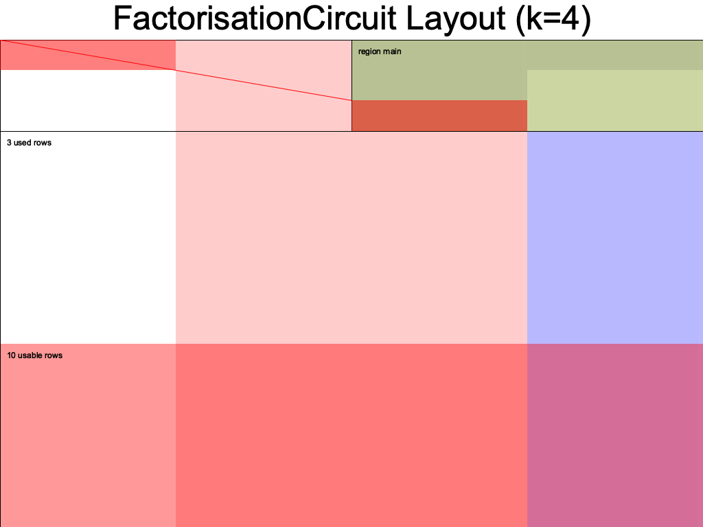

# halo2 utils

some basic utils to slightly improve dx with vanila [pse/halo2](https://github.com/privacy-scaling-explorations/halo2).

## estimate k

```rust
let circuit = FactorisationCircuit {
    a: Fr::from(2),
    b: Fr::from(3),
    _marker: std::marker::PhantomData,
};

halo2_utils::estimate_k(&circuit)
```

## print assignments

```rust
let circuit = FactorisationCircuit {
    a: Fr::from(2),
    b: Fr::from(3),
    _marker: std::marker::PhantomData,
};

halo2_utils::assignments::print_all(4, &circuit);
```

```
cargo run --example print_assignment

╭────────────────┬──────────────┬─────────────┬──────────────────╮
│ unnamed advice │ advice colm  │ my selector │ unnamed instance │
├────────────────┼──────────────┼─────────────┼──────────────────┤
│ Unassigned     │ 2            │ 1           │ 6                │
│ Unassigned     │ 3            │ 0           │ 0                │
│ Unassigned     │ 6            │ 0           │ 0                │
│ Unassigned     │ Unassigned   │ 0           │ 0                │
│ Unassigned     │ Unassigned   │ 0           │ 0                │
│ Unassigned     │ Unassigned   │ 0           │ 0                │
│ Unassigned     │ Unassigned   │ 0           │ 0                │
│ Unassigned     │ Unassigned   │ 0           │ 0                │
│ Unassigned     │ Unassigned   │ 0           │ 0                │
│ Unassigned     │ Unassigned   │ 0           │ 0                │
│ Poisoned(10)   │ Poisoned(10) │ 0           │ 0                │
╰────────────────┴──────────────┴─────────────┴──────────────────╯
```

## print info


```rust
let circuit = FactorisationCircuit::<Fr>::default();
halo2_utils::info::print(4, &circuit);
```

```
cargo run --example print_info

advice columns: 2
fixed columns: 1
instance columns: 1
selectors columns: 1
gates: 1
lookups: 0
```

## infer instance

Sometimes we are facing this error `Equality constraint not satisfied by cell (Column('Instance', 0 `. This error is due to incorrect instances passed in the MockProver which do not satisfy the copy constraints.

Hence this util infers the values of the instances from the private witnesses using copy constraints and gives you a `Vec<Vec<F>>` that you can pass and make MockProver happy temporarily. Note this is only for debugging purposes.

```rust
 let circuit = FactorisationCircuit {
    a: Fr::from(2),
    b: Fr::from(3),
    _marker: std::marker::PhantomData,
};
halo2_utils::infer_instance(&circuit, None)
// [
//     [
//         0x0000000000000000000000000000000000000000000000000000000000000006,
//     ],
// ]

```


## generate layout diagrams

abstracts some dependencies and auto estimates value of k.

```rust
use halo2_utils::LayoutPrinter;

fn main() {
    let circuit = MyCircuit::<Fr>::default();
    LayoutPrinter::from(&circuit).print();
}
```



## real prover

abstracts r/w kzg params from local files, generating instances, value of k.

```rust
use halo2_utils::RealProver;

fn main() {
    // implements halo2_proofs::plonk::Circuit and halo2_utils::CircuitExt
    let circuit = FactorizationCircuit {
        a: Fr::from(3),
        b: Fr::from(7),
        _marker: PhantomData,
    };

    // generate proofs
    let mut prover = RealProver::from(circuit);
    let (proof, public_inputs) = prover.run(/* write_to_file: */ true).unwrap();

    // verify proofs
    let verifier = prover.verifier();
    let success = verifier.run(proof, public_inputs);

    // yul verifier
    let code = verifier.generate_yul(/* write_to_file: */ true).unwrap();
}
```