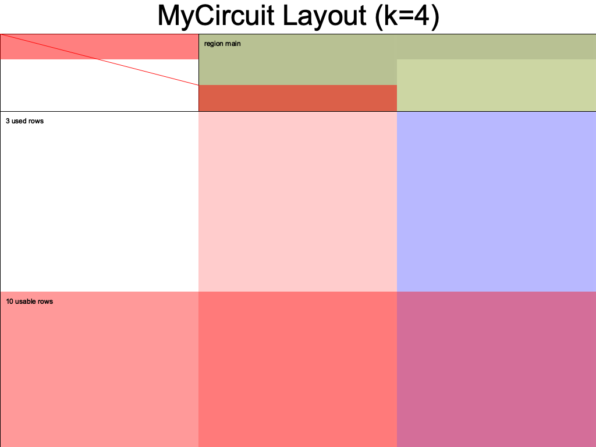

# halo2 utils

some basic utils to slightly improve dx with vanila [pse/halo2](https://github.com/privacy-scaling-explorations/halo2).

## print assignments

```rust
let circuit = FactorisationCircuit {
    a: Fr::from(2),
    b: Fr::from(3),
    _marker: std::marker::PhantomData,
};

halo2_utils::assignments::print_all(4, &circuit);
```

```
cargo run --example print_assignment

╭────────────────┬──────────────┬─────────────┬──────────────────╮
│ unnamed advice │ advice colm  │ my selector │ unnamed instance │
├────────────────┼──────────────┼─────────────┼──────────────────┤
│ Unassigned     │ 2            │ 1           │ 6                │
│ Unassigned     │ 3            │ 0           │ 0                │
│ Unassigned     │ 6            │ 0           │ 0                │
│ Unassigned     │ Unassigned   │ 0           │ 0                │
│ Unassigned     │ Unassigned   │ 0           │ 0                │
│ Unassigned     │ Unassigned   │ 0           │ 0                │
│ Unassigned     │ Unassigned   │ 0           │ 0                │
│ Unassigned     │ Unassigned   │ 0           │ 0                │
│ Unassigned     │ Unassigned   │ 0           │ 0                │
│ Unassigned     │ Unassigned   │ 0           │ 0                │
│ Poisoned(10)   │ Poisoned(10) │ 0           │ 0                │
╰────────────────┴──────────────┴─────────────┴──────────────────╯
```

## print info


```rust
let circuit = FactorisationCircuit::<Fr>::default();
halo2_utils::info::print(4, &circuit);
```

```
cargo run --example print_info

advice columns: 2
fixed columns: 1
instance columns: 1
selectors columns: 1
gates: 1
lookups: 0
```


## generate layout diagrams

abstracts some dependencies and auto estimates value of k.

```rust
use halo2_utils::LayoutPrinter;

fn main() {
    let circuit = MyCircuit::<Fr>::default();
    LayoutPrinter::from(&circuit).print();
}
```



## real prover

abstracts r/w kzg params from local files, generating instances, value of k.

```rust
use halo2_utils::RealProver;

fn main() {
    // implements halo2_proofs::plonk::Circuit and halo2_utils::CircuitExt
    let circuit = FactorizationCircuit {
        a: Fr::from(3),
        b: Fr::from(7),
        _marker: PhantomData,
    };

    // generate proofs
    let mut prover = RealProver::from(circuit);
    let (proof, public_inputs) = prover.run(/* write_to_file: */ true).unwrap();

    // verify proofs
    let verifier = prover.verifier();
    let success = verifier.run(proof, public_inputs);

    // yul verifier
    let code = verifier.generate_yul(/* write_to_file: */ true).unwrap();
}
```